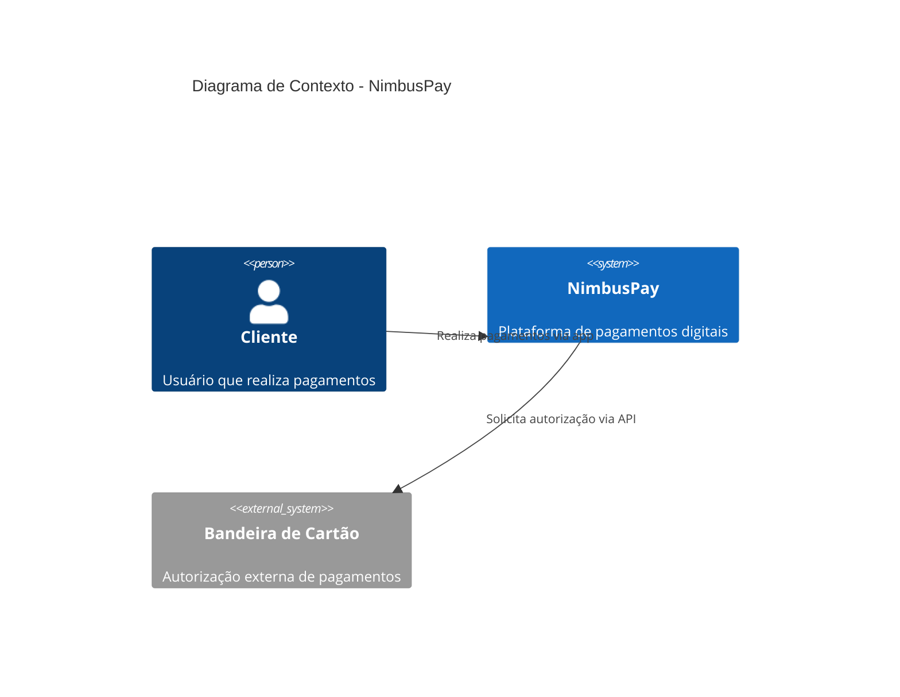
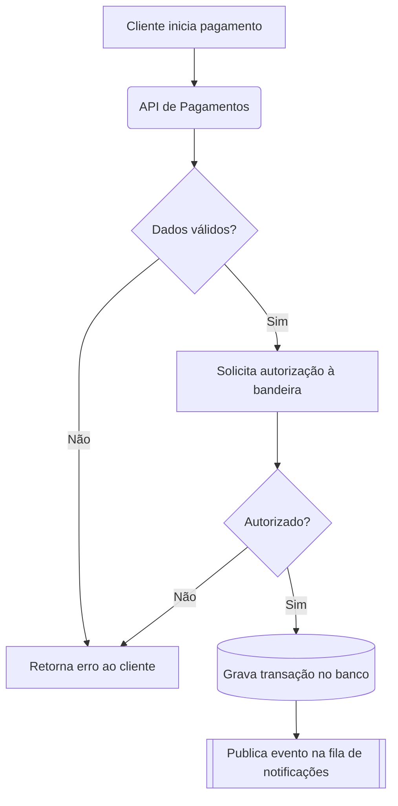
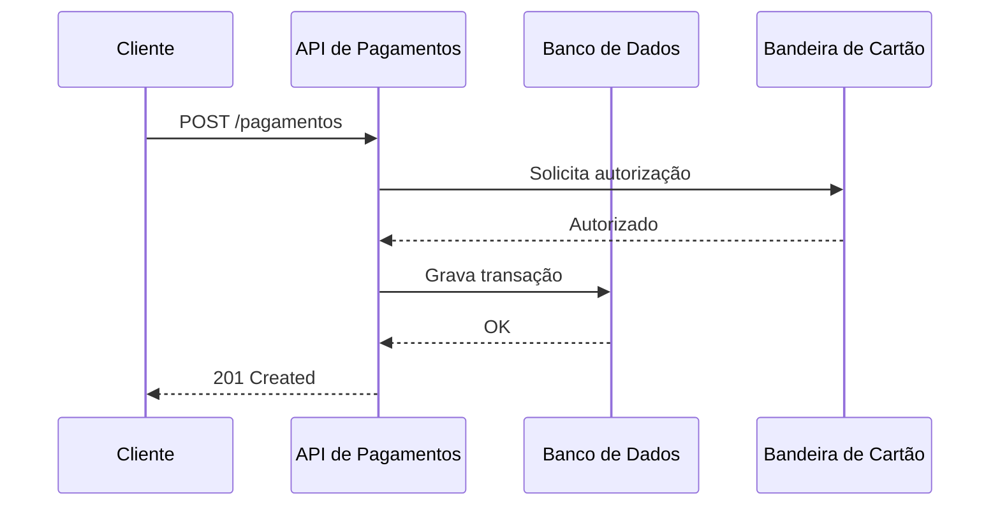
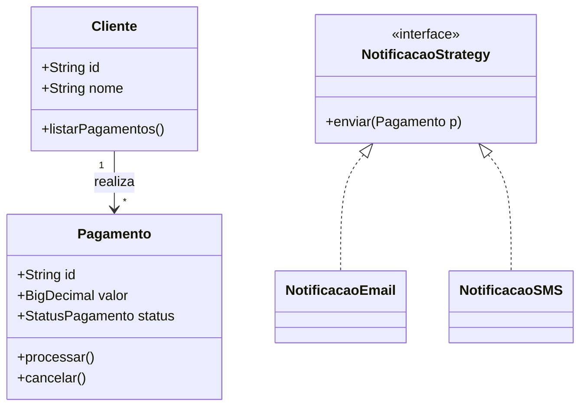

# Exemplos de Diagramas em Mermaid

Mermaid é uma linguagem de diagramas em texto puro. Diferente do draw.io (que é
majoritariamente visual/manual), o Mermaid é escrito como código — o que significa
que pode ser versionado no Git junto com o resto do projeto, e renderiza
automaticamente no GitHub, GitLab, Notion e em várias IDEs (com extensão).

O draw.io continua útil quando você quer arrastar e soltar livremente, ou importar
formas prontas (ícones de nuvem, redes, etc.) — os dois se complementam.

Para visualizar qualquer um dos exemplos abaixo sem instalar nada, cole o bloco de
código (sem os ```mermaid) em https://mermaid.live


## 1. Diagrama C4 (nível Contexto) — mesmo exemplo da NimbusPay




## 2. Fluxograma de processo — fluxo de uma transação




## 3. Diagrama de sequência — comunicação entre componentes




## 4. Diagrama de classes — modelagem de baixo nível



## Como adaptar para outro projeto
Troque os nomes dos participantes/classes/caixas e as setas de relacionamento —
a sintaxe de cada tipo de diagrama (C4Context, flowchart, sequenceDiagram,
classDiagram) permanece igual. Documentação completa: https://mermaid.js.org/
